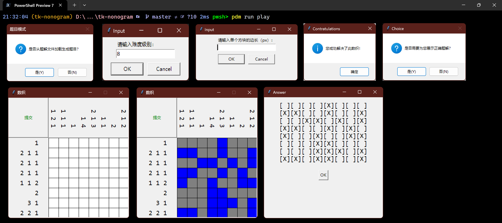
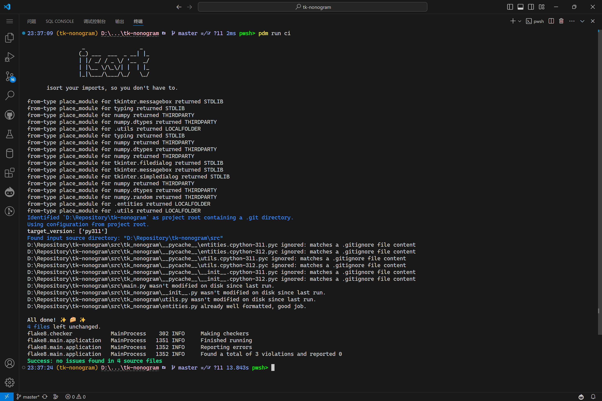

# Tk-Nonogram

## 介绍

使用 `tkinter` 库制作的数织游戏。

## 使用方法

### 一般用户（仅 *Windows* `amd64` ）

下载预编译二进制文件，双击启动。

### 进阶用户（全平台开发者）

> [!TIP]
>
> 此项目使用 [PDM](https://pdm-project.org/en/stable/) 进行管理，请您提前准备 Python v3.11 和 PDM 环境。

```powershell
# 使用 SSH Clone (推荐)
git clone --progress git@gitee.com:Dragon1573/tk-nonogram.git
# 使用 HTTPS Clone
git clone --progress https://gitee.com/Dragon1573/tk-nonogram.git

# 切换到项目目录
cd ./tk-nonogram

# 安装依赖项（仅运行）
pdm install --prod

# 启动运行（源文件模式）
pdm run play

# 安装依赖项（编译构建）
pdm install

# 安装提交钩子，用于自动格式化代码
pdm run git

# 编译构建
pdm run ci
pdm run build Numzle

# 启动运行（Windows 编译产物模式）
./dist/Numzle.exe
# 启动运行（macOS/Linux 编译产物模式）
./dist/Numzle
```

## 应用截图



